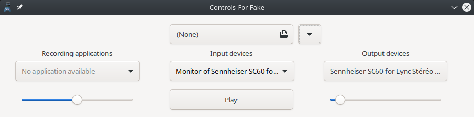
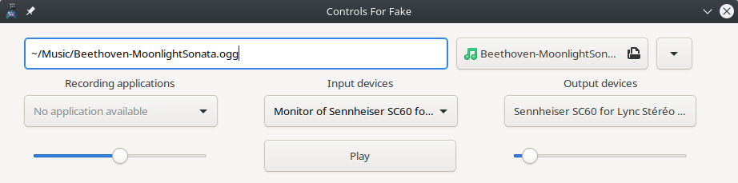

# Controls for Fake Microphone Wav Player


This is the GTK+ GUI frontend for the Fake Microphone Wav Player [https://github.com/SCOTT-HAMILTON/FakeMicWavPlayer](https://github.com/SCOTT-HAMILTON/FakeMicWavPlayer)


# Meson Building 
  To build it, run : 
  ```sh
  meson setup build
  ninja -C build
  ninja -C install
  ```

## Screenshots
Here are a few screenshots of the app.

 > The app right when launched



 > The app when all fields are entered
 


	

# Requirements
 - [FakeLib](https://github.com/SCOTT-HAMILTON/FakeLib)
 - [FakeMicWavPlayer](https://github.com/SCOTT-HAMILTON/FakeMicWavPlayer) (libFakeMicWavPlayer needed)
 - gtkmm 3.24
 - libvorbis
 - libogg
 - libpulseaudio

License
----
ControlsForFake-gtk is delivered as it is under the well known MIT License

# Todo - work in progress

 * It's not yet working, only the UI is fully working
 * Translations (french only, I don't speak that much languages, help is welcomed)


[//]: # (These are reference links used in the body of this note and get stripped out when the markdown processor does its job. There is no need to format nicely because it shouldn't be seen. Thanks SO - http://stackoverflow.com/questions/4823468/store-comments-in-markdown-syntax)
   [gtk IRC]: <irc://irc.gnome.org/gtk>
   [gtkmm doc]: <https://developer.gnome.org/gtkmm/stable>
